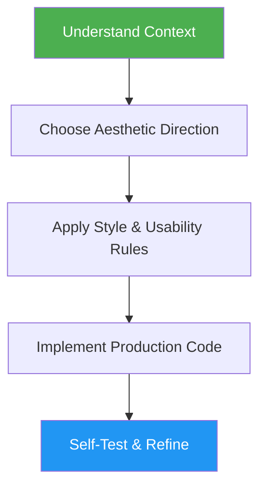

# Frontend Design

> Create distinctive, production-grade frontend interfaces with high design quality and a consistent default style guide.

## Highlights

- Bold aesthetic direction with intentional design choices, not generic AI output
- Built-in usability principles from "Don't Make Me Think" (scan-friendly, self-evident, low cognitive load)
- Default style guide (Black/White/Gray/Bright Green) when no preference is provided
- Supports HTML/CSS/JS, React, Vue, and any modern frontend framework

## When to Use

| Say this... | Skill will... |
|---|---|
| "Build a landing page" | Design and implement a distinctive landing page |
| "Create a dashboard" | Build a polished dashboard with depth and hierarchy |
| "Design a form component" | Generate a styled, accessible form with visual flair |
| "Make a portfolio page" | Create a memorable portfolio with bold aesthetics |

## How It Works



## Installation

Install via [npx (Vercel)](https://www.npmjs.com/package/skills):

```bash
npx skills add https://github.com/luongnv89/skills --skill frontend-design
```

Or via [agent-skill-manager (asm)](https://www.npmjs.com/package/agent-skill-manager):

```bash
asm install github:luongnv89/skills:skills/frontend-design
```

## Usage

```
/frontend-design
```

## Resources

| Path | Description |
|---|---|
| `references/usability-guide.md` | Full "Don't Make Me Think" step-by-step guideline with checklist |

## Output

Production-ready frontend code (HTML/CSS/JS or framework components) with distinctive typography, cohesive color theming, animations, and visual depth — usability-tested and ready to ship.

## Acknowledgement

Inspired by Anthropic's official [frontend-design](https://github.com/anthropics/claude-code/tree/main/plugins/frontend-design) skill. This skill is an independent implementation with a default style guide, usability principles from "Don't Make Me Think", and adaptations for this skill collection.
